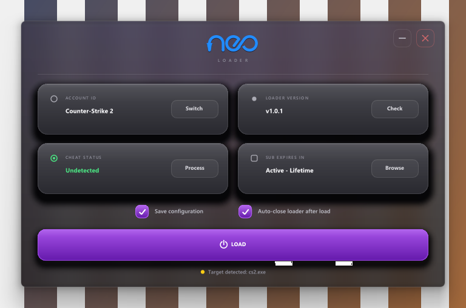

# NEO NIRVANA // Manual Map Injection Core



Loader Win32 nativo (C++17 / DirectX 11 / Dear ImGui) com injeção **exclusiva por Manual Mapping** — toda injeção via `LoadLibraryA` foi removida. A interface é uma **glassmorphism cinza translúcida** de tela única, composta de verdade pelo DWM: a janela não tem bitmap de redirecionamento, o swapchain é premultiplicado via DirectComposition e o material **Acrylic** borra o que estiver atrás. Cartões de vidro neutros com sombra escura, roxo `#9d3ce8` só no estado interativo e a marca vetorial **neo** desenhada em tempo real com `ImDrawList` no azul da marca (`#047cff`, amostrado do `neo.png`).

---

## Interface

Uma janela só, `700 x 440`, sem barras e com cantos arredondados nativos (DWM):

```
        neo                        ── ✕
      L O A D E R
─────────────────────────────────────────
◯ ACCOUNT ID        │ ● LOADER VERSION
  Counter-Strike 2  │   v1.1.0        [Check]
              [Switch]
◯ CHEAT STATUS      │ ▢ SUB EXPIRES IN
  Undetected        │   Active - Lifetime
              [Process]            [Browse]
☑ Save configuration  ☑ Auto-close loader after load
[               ⏻ LOAD                        ]
● Target detected: cs2.exe            RUNNING
```

- **Cartões de status** — rótulo em maiúsculas espaçadas, valor em negrito, glifo de estado à esquerda (anel vazio / ponto cheio / anel de status / quadrado arredondado) e um botão de ação à direita (`Switch`, `Check`, `Process`, `Browse`).
- **CHEAT STATUS** é colorido pelo próprio texto: `Undetected`/`Safe`/`Active` → verde, `Detected`/`Banned`/`Expired` → vermelho, qualquer outro → amarelo.
- **Tela de espera / injeção** — overlay central com a marca neo, spinner, manchete espaçada (`WAITING FOR TARGET` / `INJECTING PAYLOAD` / `MODULE MAPPED`), linha do alvo e botão `CANCEL`.
- **Modais** — diálogo nativo de DLL, seletor de perfis (com badge `ACTIVE`) e seletor de processos com busca e `Rescan`.
- **Toasts** — pílula inferior para feedback curto (`Waiting for cs2.exe`, `Cancelled`, `Payload mapped successfully`).
- **Som de abertura** — `rezerosound.mp3` é reproduzido no start via MCI do Win32.

### Janela composta (`src/main.cpp`)

A janela é `WS_EX_APPWINDOW | WS_EX_NOREDIRECTIONBITMAP` — ou seja, nada é copiado para um bitmap de redirecionamento do GDI. O caminho de render é:

1. `D3D11CreateDevice` (com `D3D11_CREATE_DEVICE_BGRA_SUPPORT`, fallback WARP) → `IDXGIDevice` → `IDXGIAdapter` → `IDXGIFactory2`.
2. `CreateSwapChainForComposition` com `DXGI_FORMAT_B8G8R8A8_UNORM`, `DXGI_SWAP_EFFECT_FLIP_SEQUENTIAL` e `DXGI_ALPHA_MODE_PREMULTIPLIED`.
3. `DCompositionCreateDevice` → `CreateTargetForHwnd` → `CreateVisual` → `SetContent(swapchain)` → `SetRoot` → `Commit`.
4. `DwmSetWindowAttribute(hwnd, DWMWA_SYSTEMBACKDROP_TYPE, DWMSBT_TRANSIENTWINDOW)` (Acrylic), com fallback para `DWMSBT_MAINWINDOW` e, em seguida, para `DWMWA_MICA_EFFECT` + `DwmExtendFrameIntoClientArea(-1)`.

O clear color é `{ 0, 0, 0, 0 }`. O blend state padrão do backend DX11 do ImGui (`SRC_ALPHA` / `INV_SRC_ALPHA` sobre um alvo zerado) já produz um resultado **premultiplicado** correto, então o ImGui vendorizado não foi alterado.

Como o backend Win32 do ImGui só amostra o cursor quando a janela está em foreground, o `WndProc` reenvia `WM_MOUSEMOVE` / `WM_LBUTTONDOWN` / `WM_LBUTTONUP` / `WM_LBUTTONDBLCLK` (e os equivalentes de botão direito e meio) como `ImGui::GetIO().AddMousePosEvent(...)` antes do `ImGui_ImplWin32_WndProcHandler`. Sem isso, o primeiro clique em uma janela não focada cai no vazio — era o bug do ✕ que "não fechava".

### Design system (`src/theme.h` + `src/theme.cpp`)

Namespace `Neo`, sem dependências: paleta, matemática de cor (`Mix`, `AC`), gradientes arredondados, `Glass()` (sombra em camadas + corpo gradiente + brilho interno + borda hairline), `SoftShadow()`, `Blob()` (glow radial) e `Backdrop()` (tinta neutra + um único bloom violeta em deriva lenta + vinheta). A marca `NeoLogo()` é reconstruída vetorialmente a partir da geometria medida do `neo.png` (traço monoline de 21 px sobre tinta de 124 px de altura, `R = 51.5`), então pode ser tingida em qualquer cor e tamanho. Há ainda um conjunto de 23 ícones desenhados à mão e helpers de texto com espaçamento falso.

A paleta é carvão neutro e semitransparente, calibrada para o Acrylic aparecer por baixo (`kCardTop = rgba(116,116,126,0.62)`, `kBgTop = rgba(40,40,45,0.52)`), com o roxo `#9d3ce8` reservado para **estado interativo** — toggles, checkbox, botão `LOAD` — e não para a superfície. O azul da marca fica só na logo.

---

## Estrutura

```
C:\loader\
├── src\
│   ├── main.cpp          # WinMain, janela Win32, device/swapchain DX11, fontes, loop
│   ├── ui.h / ui.cpp     # VibeUI: tela única, cartões, overlay, modais, toasts
│   ├── theme.h / theme.cpp  # sistema de design Neo (paleta, vidro, logo, ícones)
│   ├── audio.h / audio.cpp  # reprodução MCI do rezerosound.mp3 na abertura
│   ├── injection.h / injection.cpp  # manual mapping puro (x64/x86, TLS, SEH, IAT)
│   ├── updater.h / updater.cpp      # auto-update assíncrono via GitHub Releases
│   ├── config.h / config.cpp        # perfis e ajustes em loader_config.json
│   ├── version.h         # LOADER_VERSION_TAG
│   ├── dummy_dll.cpp     # DLL de teste
│   └── test_injector.cpp # injetor de linha de comando
├── imgui\                # Dear ImGui 1.93 + backends Win32 / DX11
├── bin\                  # NeoNirvana.exe, loader_config.json, rezerosound.mp3
├── build.bat             # compilação MSVC x64
└── loader_config.json    # configuração raiz
```

---

## Compilar e executar

```cmd
cd C:\loader
build.bat
bin\NeoNirvana.exe
```

`build.bat` chama o `vcvars64.bat` do Visual Studio, compila `src\*.cpp` + o ImGui vendorizado e liga `d3d11 dxgi dcomp dwmapi user32 gdi32 comctl32 ole32 shell32 wininet advapi32 winmm`. A saída é `bin\NeoNirvana.exe`, e o `rezerosound.mp3` é copiado para `bin\` junto.

O manifesto é `asInvoker`; para injetar em um processo elevado, execute o loader como Administrador.

---

## Injeção manual map

- Mapeamento direto de seções PE (`IMAGE_SECTION_HEADER`), sem `LoadLibrary`.
- Relocações de base (`IMAGE_BASE_RELOCATION`) para x64 e x86.
- Resolução remota da IAT, com suporte a imports por ordinal e por nome.
- Callbacks TLS (`IMAGE_DIRECTORY_ENTRY_TLS`).
- Registro da tabela de exceções estruturadas x64 (`RtlAddFunctionTable`).
- Limpeza do shellcode e dos parâmetros na memória do alvo após a execução.
- `SeDebugPrivilege` habilitado automaticamente.

Se o processo alvo não estiver aberto, o `LOAD` entra no estado **waiting**: o loader fica verificando o PID a cada 0,5 s por até 90 s e injeta sozinho assim que o executável aparecer.

---

## Configuração (`loader_config.json`)

```json
{
  "operatorName": "spawnyk1ng",
  "activeProfileIndex": 0,
  "autoCloseOnInject": true,
  "waitForProcess": false,
  "saveSelection": true,
  "autoCheckUpdates": false,
  "loaderGithubRepo": "M70000/NEO-LOADER",
  "loaderVersion": "v1.1.0",
  "profiles": [
    {
      "name": "Counter-Strike 2",
      "exeName": "cs2.exe",
      "dllPath": "payloads/cs2_module.dll",
      "githubRepo": "Paxai/DLLium",
      "githubAsset": ".dll",
      "directUrl": "",
      "version": "Latest",
      "statusText": "Undetected"
    }
  ]
}
```

O arquivo é lido do **diretório de trabalho atual**, não do diretório do executável — iniciar `bin\NeoNirvana.exe` a partir de `C:\loader` usa o `loader_config.json` da raiz.

---

## Requisitos

- Windows 10/11 x64 (o blur Acrylic precisa do Windows 11 22H2+; em versões anteriores a janela continua translúcida, só sem desfoque)
- Visual Studio 2022+ com toolset C++ (x64)
- Nenhuma dependência externa além do ImGui vendorizado
